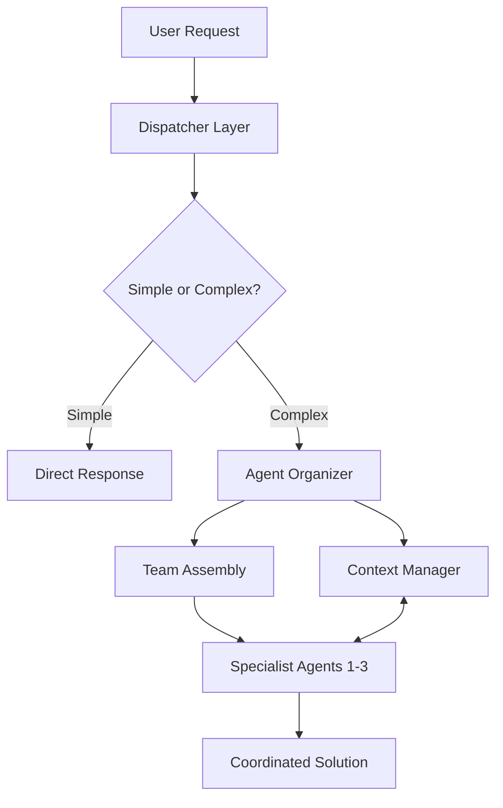

# PROJECT_INDEX.md - Claude Code Sub-Agents Collection

<!-- Generated: 2025-08-03 -->
<!-- Total Agents: 41 (33 core + 8 timezyme-specific) -->
<!-- Status: Active Development -->

## 📚 Table of Contents

1. [Overview](#overview)
2. [Quick Start](#quick-start)
3. [Core Architecture](#core-architecture)
4. [Agent Directory](#agent-directory)
5. [Agent Categories](#agent-categories)
6. [Integration Patterns](#integration-patterns)
7. [Usage Examples](#usage-examples)
8. [Project Structure](#project-structure)

## Overview

**Claude Code Sub-Agents Collection** is a comprehensive multi-agent AI framework that transforms Claude Code into a powerful collaborative development platform. The system provides 41 specialized AI agents (33 core + 8 Timezyme-specific) that work together to handle complex software development tasks.

### Key Metrics
- **Total Agents**: 41 specialized domain experts
- **Categories**: 8 primary domains
- **Token Usage**: 300K-850K for complex workflows
- **Model Distribution**: 
  - Haiku: 4 agents (lightweight orchestration)
  - Sonnet: 37 agents (deep domain expertise)
- **MCP Integration**: Full support for sequential-thinking, context7, magic, playwright

## Quick Start

```bash
# Place agents in your project (recommended approach)
cp -r ./agents ~/.claude/agents/

# For project-specific multi-agent orchestration
cp CLAUDE.md /path/to/your/project/

# Verify installation
ls ~/.claude/agents/*.md | wc -l  # Should show 41
```

## Core Architecture

### 🎯 Three-Layer System



### Key Components

1. **Dispatcher (CLAUDE.md)** - Entry point, complexity assessment
2. **Orchestrator (agent-organizer.md)** - Team assembly, workflow planning
3. **Context Manager (context-manager.md)** - State management, cross-agent communication
4. **Specialists (41 agents)** - Domain expertise, implementation

## Agent Directory

### 🧠 Orchestration Layer (3 agents)

| Agent | Model | Primary Role | Key Capabilities |
|-------|-------|--------------|------------------|
| **agent-organizer** | haiku | Master orchestrator | Team assembly, workflow planning, delegation strategy |
| **context-manager** | haiku | Project intelligence | State management, cross-agent communication, activity tracking |
| **product-manager** | sonnet | Product strategy | Feature prioritization, user story creation, roadmap planning |

### 💻 Development Specialists (14 agents)

| Agent | Model | Specialization | Technologies |
|-------|-------|----------------|--------------|

```
┌─────────────────────────────────────────────────────────────┐
│                      Claude Code (Dispatcher)                │
│  • Receives user requests                                    │
│  • Evaluates complexity                                      │
│  • Routes to appropriate handler                             │
└───────────────────┬─────────────────────────────────────────┘
                    │
                    ▼
┌─────────────────────────────────────────────────────────────┐
│                    Agent Organizer (Haiku)                   │
│  • Analyzes project requirements                             │
│  • Assembles optimal agent teams (1-3 agents)                │
│  • Coordinates execution strategy                            │
└───────────────────┬─────────────────────────────────────────┘
                    │
         ┌──────────┴──────────┬────────────────┐
         ▼                     ▼                ▼
┌─────────────────┐  ┌─────────────────┐  ┌─────────────────┐
│ Context Manager │  │ Specialized     │  │   MCP Servers   │
│ • Project state │  │    Agents       │  │ • sequential    │
│ • Knowledge     │  │ • 33 experts    │  │ • context7      │
│   graph         │  │ • Domain focus  │  │ • magic         │
│ • Activity logs │  │ • Tool access   │  │ • playwright    │
└─────────────────┘  └─────────────────┘  └─────────────────┘
```

---

| **frontend-developer** | sonnet | UI/UX implementation | Vue 3, Nuxt 4, Tailwind CSS, TypeScript |
| **backend-architect** | sonnet | API & server design | Nitro, Cloudflare Workers, GraphQL, REST |
| **full-stack-developer** | sonnet | End-to-end development | Nuxt 4, Vue 3, Nitro, Drizzle ORM |
| **typescript-pro** | sonnet | TypeScript expertise | Advanced types, generics, decorators |
| **python-pro** | sonnet | Python development | FastAPI, Django, data science libraries |
| **golang-pro** | sonnet | Go development | Microservices, concurrency, performance |
| **mobile-developer** | sonnet | Mobile apps | React Native, Flutter, native integrations |
| **electron-pro** | sonnet | Desktop apps | Electron, TypeScript, IPC, native APIs |
| **nuxt4-pro** | sonnet | Nuxt 4 specialist | SSR/SSG, Nitro, Vue 3, edge deployment |
| **ui-designer** | sonnet | Visual design | Figma, design systems, component libraries |
| **ux-designer** | sonnet | User experience | User research, wireframing, prototyping |
| **dx-optimizer** | sonnet | Developer experience | Tooling, workflows, build optimization |
| **legacy-modernizer** | sonnet | Legacy migration | Refactoring, migration strategies, tech debt |

### 🗄️ Data & AI Specialists (8 agents)

| Agent | Model | Focus Area | Key Technologies |
|-------|-------|------------|------------------|
| **data-engineer** | sonnet | Data pipelines | ETL, streaming, batch processing |
| **data-scientist** | sonnet | Analytics & modeling | Python, R, ML frameworks |
| **database-optimizer** | sonnet | DB performance | SQLite, D1, Drizzle ORM, indexing |
| **sqlite3-pro** | sonnet | SQLite mastery | Performance tuning, edge databases |
| **graphql-architect** | sonnet | GraphQL APIs | Schema design, resolvers, federation |
| **ai-engineer** | sonnet | AI/ML systems | LLMs, embeddings, vector databases |
| **ml-engineer** | sonnet | ML operations | Model training, deployment, monitoring |
| **prompt-engineer** | sonnet | LLM optimization | Prompt design, chain-of-thought, agents |

### ☁️ Infrastructure & DevOps (5 agents)

| Agent | Model | Responsibility | Technologies |
|-------|-------|----------------|--------------|  
| **cloud-architect** | sonnet | Cloud infrastructure | Cloudflare, Terraform, edge computing |
| **deployment-engineer** | sonnet | CI/CD pipelines | GitHub Actions, Docker, Kubernetes |
| **devops-incident-responder** | sonnet | Incident management | Monitoring, alerting, root cause analysis |
| **incident-responder** | sonnet | Critical incidents | SRE practices, war rooms, postmortems |
| **performance-engineer** | sonnet | Performance optimization | Profiling, load testing, bottleneck analysis |

### ✅ Quality & Testing (5 agents)

| Agent | Model | Focus | Methodologies |
|-------|-------|-------|--------------|
| **qa-expert** | sonnet | Quality assurance | Test planning, edge cases, regression |
| **test-automator** | sonnet | Test automation | E2E, unit tests, integration tests |
| **code-reviewer** | sonnet | Code quality | Best practices, security, performance |
| **architect-reviewer** | sonnet | Architecture review | Design patterns, scalability, maintainability |
| **debugger** | sonnet | Problem solving | Root cause analysis, debugging strategies |

### 🔒 Security (1 agent)

| Agent | Model | Expertise | Standards |
|-------|-------|-----------|----------|
| **security-auditor** | sonnet | Security assessment | OWASP, penetration testing, compliance |

### 📝 Specialization (2 agents)

| Agent | Model | Purpose | Deliverables |
|-------|-------|---------|--------------|  
| **documentation-expert** | haiku | Technical writing | API docs, guides, tutorials |
| **api-documenter** | sonnet | API documentation | OpenAPI, examples, SDKs |

### 🎯 Timezyme-Specific Agents (8 agents)

Located in `/Docs/agents/`:

| Agent | Focus Area | Integration Points |
|-------|------------|-------------------|
| **timezyme-nuxt4-specialist** | Nuxt 4 architecture | Vue 3, Nitro, SSR/SSG |
| **timezyme-edge-specialist** | Edge computing | Cloudflare Workers, D1 |
| **timezyme-saas-architect** | Multi-tenancy | Tenant isolation, billing |
| **timezyme-quality-guardian** | Code quality | Standards, reviews, metrics |
| **timezyme-test-guardian** | Testing strategy | Coverage, E2E, integration |
| **cloudflare-edge-engineer** | Cloudflare platform | Workers, KV, R2, D1 |
| **polar-billing-specialist** | Billing integration | Polar.sh, subscriptions |
| **i18n-accessibility-champion** | i18n & a11y | WCAG, localization |

## Agent Categories

### By Model Usage
- **Haiku (4)**: Lightweight orchestration tasks
- **Sonnet (37)**: Deep domain expertise and implementation

### By Primary Domain
1. **Orchestration & Management** (3)
2. **Frontend & UI/UX** (5)
3. **Backend & Systems** (9)  
4. **Data & AI/ML** (8)
5. **Infrastructure & DevOps** (5)
6. **Quality & Testing** (5)
7. **Security & Compliance** (1)
8. **Documentation & Communication** (2)
9. **Timezyme Platform** (8)

### By Tool Integration

**MCP Server Usage**:
- **sequential-thinking**: 28 agents (complex reasoning)
- **context7**: 30 agents (documentation lookup)
- **magic**: 3 agents (UI component generation)
- **playwright**: 7 agents (browser automation)

## Integration Patterns

### Common Workflows

#### 1. Full-Stack Feature Development
```
agent-organizer → frontend-developer + backend-architect + test-automator
```

#### 2. Performance Optimization  
```
agent-organizer → performance-engineer + database-optimizer + code-reviewer
```

#### 3. Security Audit
```
agent-organizer → security-auditor + backend-architect + architect-reviewer
```

#### 4. Legacy Modernization
```
agent-organizer → legacy-modernizer + full-stack-developer + test-automator
```

### Communication Protocol

All agents use standardized JSON messaging:

```json
{
  "requesting_agent": "agent-name",
  "request_type": "task_assignment",
  "payload": {
    "task": "Implementation details",
    "context": "Relevant project information"
  }
}
```

## Usage Examples

### Direct Agent Invocation
```
"Use the backend-architect to design the API structure"
```

### Multi-Agent Orchestration
```
"Build a complete user authentication system"
→ Automatically assembles: backend-architect + frontend-developer + security-auditor
```

### Specialized Tasks
```
"Optimize database performance for multi-tenant queries"
→ Activates: database-optimizer + sqlite3-pro
```

## Project Structure

```
claude-code-sub-agents-lst197/
├── Core Orchestration
│   ├── agent-organizer.md      # Master orchestrator
│   └── context-manager.md      # State management
│
├── Domain Specialists
│   ├── business/               # Product management (1)
│   ├── data-ai/                # Data & AI agents (8)
│   ├── development/            # Dev specialists (14)
│   ├── infrastructure/         # DevOps agents (5)
│   ├── quality-testing/        # QA agents (5)
│   ├── security/              # Security agents (1)
│   └── specialization/        # Documentation (2)
│
├── Project-Specific
│   ├── Docs/agents/           # Timezyme agents (8)
│   └── target-app-timezyme/   # Example project
│
├── Documentation
│   ├── CLAUDE.md              # Dispatcher protocol
│   ├── README.md              # Main documentation
│   ├── PROJECT_INDEX.md       # This file
│   └── AI_SUMMARY.md          # AI insights
│
└── Resources
    ├── _images/               # Screenshots & demos
    └── tests/                 # Agent test cases
```

## Key Features

### 🚀 Performance
- Token optimization through Haiku orchestration
- Parallel agent execution for complex tasks
- Intelligent caching via context-manager

### 🔧 Flexibility
- Mix and match agents for any task
- Custom workflows through agent-organizer
- Project-specific agent extensions

### 📊 Observability
- Activity tracking in context-manager.json
- Agent communication logs
- Performance metrics per agent

### 🛡️ Quality
- Built-in review agents
- Automated testing specialists
- Security-first design

## Best Practices

1. **Use agent-organizer for complex tasks** - Let it assemble optimal teams
2. **Leverage context-manager** - Maintains project state across agents
3. **Start with 1-3 agents** - Expand team size only when needed
4. **Follow communication protocol** - Ensures smooth agent collaboration
5. **Monitor token usage** - Complex workflows can use 300K-850K tokens

## Next Steps

- Review individual agent files for detailed capabilities
- Check `/Docs/agents/` for Timezyme-specific implementations
- Explore `_images/` for workflow examples
- Run tests in `/tests/` to validate agent functionality

---

*Generated by /sc:index command*
*Last Updated: 2025-08-03*